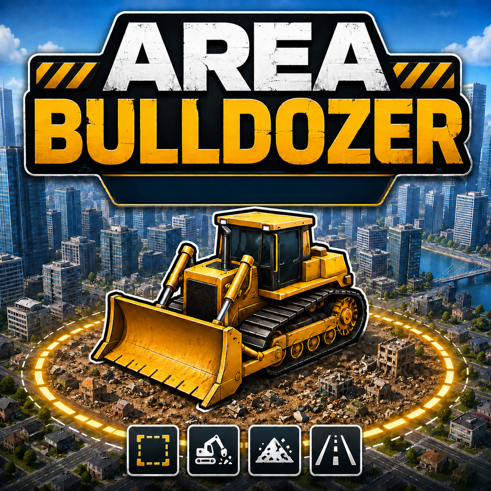

# Area Bulldozer

Area Bulldozer is an area deletion tool for **Cities: Skylines II**.
Instead of removing objects individually, you can select and delete multiple objects using circular, square, triangular or multi-point corridor selections. The tool includes configurable object filters, marker visualization and several safety options.

## Selection shapes

- Circle - adjustable radius around the cursor
- Square - adjustable size and free rotation
- Equilateral triangle - adjustable size and free rotation
- Multi-point line - corridor selection using 2 to 15 points

The multi-point line also replaces the former dedicated line mode: simply use two points for a straight corridor. Additional points allow angled or complex deletion paths.

## Features

- Live preview of the selected area
- Adjustable selection size and corridor width
- Rotation for square and triangle selections
- Multi-point corridors with up to 15 points
- Compact in-game tool interface
- Configurable interface scaling
- Optional launcher button in the universal mod menu
- Optional movable launcher button
- Configurable keyboard shortcut

## Object filters

The following object categories can be enabled or disabled individually:

- Vegetation
- Buildings
- Roads
- Pedestrian paths
- Railway tracks
- Surfaces and areas
- Props and markers

Additional filters are available for:

- General props
- Streetlights
- Trash containers and quantity objects
- Advertising and branding objects
- Activity locations
- Spawn locations
- Asset lanes and sublanes

## Marker visibility

Activity locations, spawn locations and other normally hidden markers can be highlighted while using the tool.
An optional background-darkening effect can improve marker visibility. The darkening strength can be configured in the mod options.

## Safety options

Area Bulldozer includes additional safety settings for potentially sensitive objects:

- Include or exclude building sub-objects
- Include or exclude network sub-objects
- Protect objects assigned to another owner
- Require confirmation for large selections
- Configure the large-selection confirmation threshold

Large selections are shown in yellow and require a second confirmation click when the configured threshold is reached.

## How to use

1. Activate Area Bulldozer using the launcher button, the normal Bulldozer integration, the universal mod menu or the configured keyboard shortcut.
2. Select Circle, Square, Triangle or Multi-point line.
3. Adjust the selection size or corridor width.
4. For Square and Triangle, rotate with the interface or by holding the right mouse button and moving the mouse horizontally.
5. Enable the object filters you want to use.
6. For Circle, Square and Triangle, hold or click the left mouse button to delete selected objects.
7. For Multi-point line, left click to place points, double-click to finish and delete, right click to remove the last point, and press Esc to cancel the complete selection.

The floating launcher button can optionally be moved by holding Ctrl and the left mouse button. Release the mouse button to save its new position.

## Credits and inspiration

Area Bulldozer was inspired by the work of other Cities: Skylines II mod developers, especially:

- [Better Bulldozer](https://github.com/yenyang/BetterBulldozer) by yenyang
- [Radius Delete Mod](https://github.com/kurupted/Cities2_RadiusDeleteMod) by gnznroses

Special thanks to both developers for their work and their contributions to the Cities: Skylines II modding community.

Area Bulldozer is an independent implementation and is not officially affiliated with these mods or their developers.

## Transparency note

- Some parts of the code are built with AI assistance.
- Some parts of the UI elements were built entirely with AI assistance, and I also rely on AI for debugging and troubleshooting.

## Bug reports

When reporting a problem, include:

- A detailed description of what happened
- The selected object filters
- The selected safety settings
- Steps that reproduce the problem

## Changes

Version 1.5.0

- Added a new Free Area Polygon selection mode, based on the district tool
- Multiline selection now supports up to 25 points instead of 15.

## License

Copyright (c) 2026 franky0078

Area Bulldozer is licensed under the **MIT License**.

You may use, copy, modify, merge, publish, distribute, sublicense and/or sell copies of the software, provided that the copyright notice and permission notice are included in all copies or substantial portions of the software.

The software is provided **as is**, without warranty of any kind.

See the [`LICENSE`](LICENSE) file for the complete license text.
